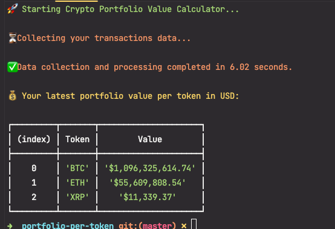

# Crypto Portfolio Value Calculator

This command-line program calculates the latest portfolio value per token in USD based on a CSV file containing crypto transaction data. The program is written in TypeScript and uses Node.js.

## Prerequisites

- [Node.js](https://nodejs.org/) (>= 14.x)
- [npm](https://www.npmjs.com/) (>= 6.x)


## Installation

1. Clone the repository:

```bash 
git clone https://github.com/tuanpa21/crypto-portfolio-calculator.git
```


2. Navigate to the project directory and install dependencies:

```bash
npm install
```

## Usage

To run the program, execute the following command:

```bash
npm run start
```
The program will read transaction data from a CSV file hosted at the specified URL, calculate the token balances, and display the latest portfolio value per token in USD using the CryptoCompare API for exchange rates.

## Design Decisions

1. **Language choice**: TypeScript was chosen as the programming language because it provides strong typing and better code organization, which is beneficial for code maintainability and extensibility. Additionally, the main project stack is in JavaScript/TypeScript, and the goal was to assess proficiency in these languages.

2. **CSV data handling**: The `csv-parser` library was used to read and parse the CSV data. It provides an easy-to-use, efficient, and stream-based approach to handling CSV files, making it suitable for large datasets.

3. **Data storage**: The token balances were calculated using a `Map` instead of an object, as it provides better key-value management and improved performance when working with a large number of tokens.

4. **Currency formatting**: The `Intl.NumberFormat` object was used to format currency values in a consistent and user-friendly manner. It is a built-in JavaScript feature that handles localization and formatting of numbers, currencies, and percentages.

5. **Console output**: The `chalk` library was used to enhance the console output with colors, making it more visually appealing and easier to read. Emojis and progress messages were added to provide a more interactive user experience and make the application feel more like a running app. The execution time was also displayed to give users an idea of how long the process took.

## Implementation Details
What I tried to archive this output.

1. **Fetching CSV data**: The program reads the CSV data from the specified URL using the `axios` library. The data is streamed directly into the `csv-parser` library to parse the data efficiently.

2. **Parsing CSV data**: The `csv-parser` library processes the CSV data row by row, converting it into a stream of JavaScript objects. During this process, the token balances are calculated by adding deposits and subtracting withdrawals.

3. **Fetching exchange rates**: The CryptoCompare API is used to fetch the current USD exchange rates for the tokens in the portfolio. An API request is made for each unique token, and the results are stored in a `Map`.

4. **Calculating portfolio value**: The token balances and exchange rates are combined to calculate the latest portfolio value per token in USD.

5. **Formatting output**: The `Intl.NumberFormat` object is used to format the currency values consistently. The console output is enhanced with the `chalk` library to provide a visually appealing and interactive experience.

## Extending Features

1. **Support for multiple currencies**: You can extend the application to support multiple currencies by modifying the CryptoCompare API call to fetch exchange rates for other currencies and updating the currency formatting accordingly.

2. **Command-line arguments**: Add command-line argument support to customize the application's behavior, such as specifying a custom CSV file location, selecting the output currency, or applying filters to the displayed data.

3. **Persisting data**: Implement a local or cloud-based storage solution to save the portfolio data and track its historical changes over time. This will enable users to analyze their portfolio's performance and trends.

4. **Interactive user interface**: Develop a user-friendly CLI or web-based interface to allow users to interact with the application more easily, perform actions such as adding transactions, and visualize their portfolio data.

5. **Customizable data sources**: Allow users to choose from multiple data sources for fetching transaction data and exchange rates. This can help improve data accuracy and provide a more comprehensive view of the user's portfolio.


## A screenshot demo of the program

